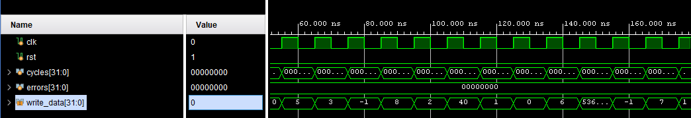
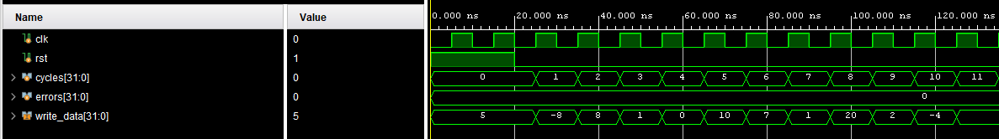
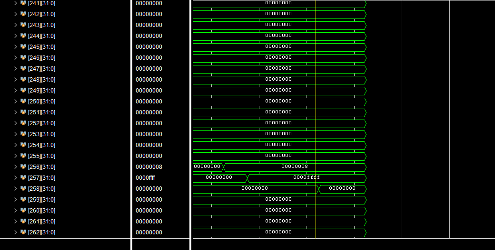
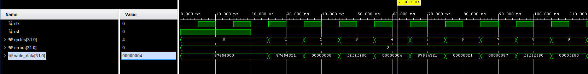
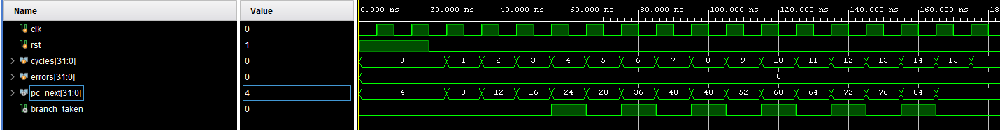
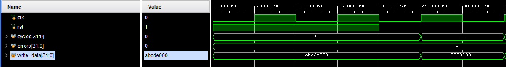
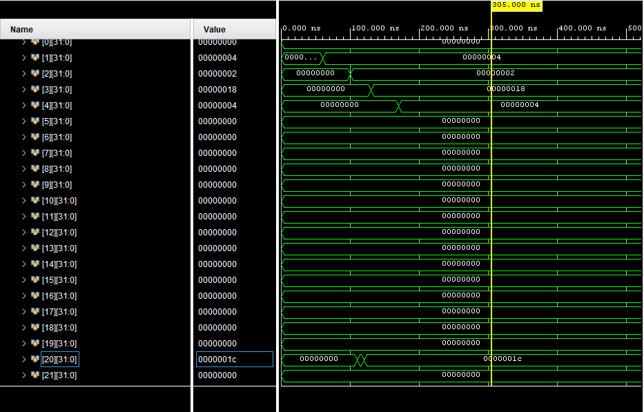

# Project 1 — Milestone 3 Report

**5-stage Pipelined RV32I Processor with Unified Single-Port Memory,
2-bit Branch Prediction, and Selective Single-Port Stalling**

| Team member              | ID        |
| ------------------------ | --------- |
| Abdallah Mostafa Ibrahim | 900232544 |
| John Saif                | 900232149 |

---

## 1. Introduction

This report documents Milestone 3 of Project 1: a 5-stage pipelined
implementation of the RV32I base integer instruction set. The core
supports all 37 user-level instructions and treats the five halting
opcodes (`ecall`, `ebreak`, `fence`, `fence.tso`, `pause`) as halt
instructions. Compared to Milestone 2, this milestone adds:

- A 5-stage pipeline (IF - ID - EX - MEM - WB) with four pipeline
  registers, each promoted into its own module under
  `verilog/core/stages/`.
- A **single, single-ported, byte-addressable memory** shared
  between instruction fetch and data access.
- A forwarding unit for EX/MEM and MEM/WB bypassing.
- A hazard unit for load-use stalls and single-port memory
  structural hazards.
- Negative-edge register-file writes so 3-instruction RAW hazards
  resolve without an extra stall.
- Flush logic that flushes the three wrong-path instructions behind
  a misprediction, JAL, or JALR.

Two bonuses are delivered for this project:

- **Bonus 3 - 2-bit dynamic branch prediction.**
Instead of assuming "not taken" every time, the processor now *learns* from history. It uses two small lookup tables, each with 64 slots: BHT (Branch History Table): Each slot holds a 2-bit counter that tracks how a branch has behaved recently. It takes two wrong predictions in a row to actually change its state, making it more stable than a simple 1-bit predictor. BTB (Branch Target Buffer): Remembers *where* a branch jumped to last time, so the processor knows which address to fetch from if it predicts "taken." Both tables are checked instantly during the **Fetch** stage (no waiting), and updated later in the **MEM** stage once the branch outcome is known. The big payoff: if the prediction turns out to be correct, the pipeline keeps running smoothly with **no flush needed** — saving those precious wasted cycles.

- **Bonus 5 - alternative single-port memory solution.** Rather
  than the solution proposed in the lecture which makes the CPI=2 , we keep the 5-stage pipeline and stall IF only on
  cycles when MEM holds the port. Straight-line ALU code therefore
  runs at CPI 1; CPI degrades toward 2 only on load/store-dense
  regions.


## 2. Design

### 2.1 Datapath block diagram

> 
>
> Schematic of the 5-stage pipelined datapath with unified
> single-port memory, forwarding, stall, flush, and branch
> prediction paths.

The five stages share one 32-bit data path, separated by the four
pipeline registers `if_id_reg`, `id_ex_reg`, `ex_mem_reg`, and
`mem_wb_reg`. Two backward paths cross the pipe: the WB-to-ID
register-file write port (negedge), and the MEM-to-IF redirect /
predictor-update path. 

**IF.** The PC is held in a `register` primitive; next-PC is the
output of `pc_control_unit`, which has five sources in priority
order: `(rs1 + imm) & ~1` for JALR, `pc + imm` for a NT-to-T
mispredict or for JAL, `pc + 4` for a T-to-NT mispredict,
`predict_target` if the predictor says taken, and `pc + 4` as the
fall-through. The load enable of the PC and IF/ID register is
`flush | (~halting & ~stall)`: flush always overrides stall so a
branch redirect can clear a stalled wrong-path instruction. The
predictor lookup is combinational on `pc_out`, so the speculatively
fetched target enters IF on the same cycle.

**ID.** `control_unit` decodes the instruction, `immediate_gen`
extracts the immediate, and the register file is read
combinationally. The `hazard_unit` watches the ID/EX register to
detect load-use and structural hazards (see 3.3). On stall or
flush, the ID/EX register latches zeros so a NOP bubble appears in
EX next cycle.

**EX.** The `forwarding_unit` selects the freshest value for rs1 /
rs2 (see 3.2); the muxed values feed the existing `alu_src_a` /
`alu_src_b` muxes. The ALU computes the result and flags; a
parallel `ripple` adder computes `pc + imm` for branches and JAL.

**MEM.** Branch resolution lives here (textbook MIPS-style):
`branch_unit` turns the latched ALU flags into `taken`,
`pc_control_unit` compares against `ex_mem_predicted_taken` to
detect a misprediction, and the next-PC logic picks between
`pc_plus_imm` (taken redirect), `pc_plus_4` (not-taken redirect),
`jalr_target` (`alu_out & ~1`), and the IF-stage prediction or
fall-through. `store_unit` builds the byte mask and replicated
wdata, `load_unit` picks / extends the read word. Both talk to the
unified memory port. The same cycle, `branch_predictor.update_*`
fires for any conditional branch resolved in MEM, advancing the
2-bit BHT counter and (on a taken outcome) allocating a BTB entry.

**WB.** A 3:1 mux picks `alu_out`, `load_out`, or `pc+4` based on
`wb_src`. The reg-file write port fires on the negative clock edge
so WB finishes before the next ID read.

### 2.2 Top-level modules

These are the modules directly instantiated from
`verilog/core/riscv.v`. Five pipeline stages share one 32-bit
data path, connected through four per-stage pipeline-register
modules built on top of the `register` primitive.

| Block               | File                                          | Stage | Role                                                                    |
| ------------------- | --------------------------------------------- | ----- | ----------------------------------------------------------------------- |
| PC register         | `verilog/primitives/register.v`               | IF    | Holds current PC; `load` gated by halt / stall / flush.                 |
| PC + 4 adder        | `verilog/primitives/ripple.v`                 | IF    | Sequential next PC.                                                     |
| Branch predictor    | `verilog/core/branch_predictor.v`             | IF/MEM| 64-entry 2-bit BHT + BTB; lookup IF, update MEM.                        |
| PC control unit     | `verilog/core/pc_control_unit.v`              | IF/MEM| Picks next PC from {JALR, MEM redirect, predictor, pc+4}; emits flush.  |
| Unified memory      | `verilog/memory/memory.v`                     | IF/MEM| 4 KiB single-port byte-addressable; holds inst + data.                  |
| IF/ID register      | `verilog/core/stages/if_id_reg.v`             | -     | 97 bits: `{inst, pc+4, pc, predicted_taken}`.                           |
| Control unit        | `verilog/core/control_unit.v`                 | ID    | Decodes opcode into all control signals.                                |
| Immediate gen       | `verilog/core/immediate_gen.v`                | ID    | Extracts immediate for all RV32I formats.                               |
| Register file       | `verilog/core/reg_file.v`                     | ID/WB | 32 x 32 bits; write on **negedge**, read combinational.                 |
| Hazard unit         | `verilog/core/hazard_unit.v`                  | ID    | Generates `stall` (load-use + structural).                              |
| ID/EX register      | `verilog/core/stages/id_ex_reg.v`             | -     | ~242 bits: reg data, imm, rd, rs1/rs2, funct3, control, predicted bit.  |
| Forwarding unit     | `verilog/core/forwarding_unit.v`              | EX    | Selects newest value for rs1/rs2 (id_ex / EX/MEM / MEM/WB).             |
| ALU                 | `verilog/core/alu.v`                          | EX    | 10 ops, 4-bit selector, returns Z/C/V/N flags.                          |
| PC + imm adder      | `verilog/primitives/ripple.v`                 | EX    | Computes branch / JAL target.                                           |
| EX/MEM register     | `verilog/core/stages/ex_mem_reg.v`            | -     | ~196 bits: alu_out, rs2, pc, pc+4, pc+imm, rd, funct3, flags, control.  |
| Branch unit         | `verilog/core/branch_unit.v`                  | MEM   | Uses ALU flags + funct3 to decide `taken`.                              |
| Store / Load units  | `verilog/memory/{store,load}_unit.v`          | MEM   | Byte / halfword selection + mask / extension.                           |
| MEM/WB register     | `verilog/core/stages/mem_wb_reg.v`            | -     | 105 bits: alu_out, load_out, pc+4, rd, wb_src, reg_write, halt.         |
| Writeback mux       | inside `riscv.v`                              | WB    | 3:1 mux across `alu_out`, `load_out`, `pc+4`.                           |

### 2.3 Control-signal summary

All control signals are produced by `control_unit.v` in the ID stage
and travel down the pipeline inside the pipeline registers. The
full set is unchanged from MS2:

| Signal      | Width | Meaning                            |
| ----------- | ----- | ---------------------------------- |
| `alu_sel`   | 4     | ALU op (from `defines.v`)          |
| `alu_src_a` | 2     | `00`=rs1, `01`=PC, `10`=0          |
| `alu_src_b` | 1     | `0`=rs2, `1`=imm                   |
| `branch`    | 1     | branch instruction                 |
| `jump`      | 1     | `jal` or `jalr`                    |
| `jalr`      | 1     | `jalr` specifically                |
| `mem_read`  | 1     | loads                              |
| `mem_write` | 1     | stores                             |
| `wb_src`    | 2     | `00`=ALU, `01`=mem, `10`=PC+4      |
| `reg_write` | 1     | register writeback                 |
| `halt`      | 1     | ECALL / EBREAK / FENCE* / PAUSE    |

`predicted_taken` (1 bit) is *not* a control signal, it is produced by the IF-stage predictor and threaded down
the pipeline registers separately so MEM can compare it against the
true outcome.

### 2.4 ALU encoding

The ALU uses a 4-bit selector defined in `verilog/core/defines.v`:

| `alu_sel` | Op   |
| --------- | ---- |
| `0000`    | ADD  |
| `0001`    | SUB  |
| `0011`    | PASS |
| `0100`    | OR   |
| `0101`    | AND  |
| `0111`    | XOR  |
| `1000`    | SRL  |
| `1001`    | SLL  |
| `1010`    | SRA  |
| `1101`    | SLT  |
| `1111`    | SLTU |

Branches force `ALU_SUB` so the branch unit can read Z / C / N / V.

---

## 3. Implementation

### 3.1 Forwarding

`forwarding_unit` produces two 2-bit mux selects:

| Sel    | Source                          | When                                               |
| ------ | ------------------------------- | -------------------------------------------------- |
| `2'b00`| `id_ex_rs{1,2}_data` (no fwd)   | No RAW match with EX/MEM or MEM/WB.                |
| `2'b10`| `ex_mem_alu_out` (EX hazard)    | EX/MEM writes the same reg EX reads (and not x0). |
| `2'b01`| `wb_data_wb` (MEM hazard)       | MEM/WB writes the same reg, no newer EX hazard.   |

This catches 1- and 2-instruction RAW. The 3-instruction RAW case
is handled implicitly by writing the reg file on the negative clock
edge (`reg_file.v` line 28) so the write lands before ID's next
read.

### 3.2 Hazard / stall logic

`hazard_unit` produces a single `stall` wire covering two cases:

1. **Load-use hazard.** The instruction in EX is a load
   (`id_ex_c_mem_read`) and its `rd` matches `rs1` or `rs2` of the
   instruction in ID. Forwarding cannot rescue this because the
   load result isn't available until MEM/WB. The fix: stall IF and
   ID for one cycle and bubble ID/EX so next cycle MEM/WB
   forwarding hits.

2. **Single-port memory structural hazard.** See §3.5 

When `stall` is asserted:

- PC `load = 0` - PC holds.
- IF/ID `load = 0` - the dependent / pending inst stays in ID.
- ID/EX input is forced to zero - NOP bubble into EX.

Flush always overrides stall so a branch redirect in MEM can
immediately kill the wrong-path instruction even if it happens to
be stalled.

### 3.3 Flush on control hazards

Branches, JAL, and JALR all resolve in MEM. By the time the
redirect signal rises, three wrong-path instructions are in IF, ID,
and EX. We flush them by forcing the bubble input of `if_id_reg`,
`id_ex_reg`, and `ex_mem_reg` to one for one cycle.

```
pc_rel_taken     = mispred_nt_to_t | (ex_mem_c_jump & ~ex_mem_c_jalr);
pc_rel_not_taken = mispred_t_to_nt;
flush            = pc_rel_taken | pc_rel_not_taken | ex_mem_c_jalr;
```

### 3.4 Single-port memory: selective stalling 

**Memory Layout.** The memory is a single block of 1024 words (32-bit each). Reads happen instantly (combinational); writes are clocked. Its output is shared. The same data feeds both the fetch path and the load path, depending on context.

**The Single-Port Problem.** Since both instruction fetch (IF) and memory access (MEM) need the same port, they can't both use it at once. The proposed solution in the lecture was to slow the whole pipeline down to one instruction every two cycles. We took a different approach: keep the normal 5-stage pipeline, and only stall IF on cycles when MEM is actually using the port:

```verilog
assign mem_stall = ex_mem_c_mem_read | ex_mem_c_mem_write;
```

When a stall is triggered, the PC holds, the IF/ID register holds, and a bubble is inserted into EX the same mechanism used for load-use hazards. When MEM isn't doing any memory work, IF fetches freely as usual.

**Why This Is Better.** Code with no memory traffic runs at full speed (CPI = 1). Only load/store-heavy code takes a hit, and even then, only on the specific cycles that actually need the memory port. The porposed solution would have run everything at CPI = 2 regardless even a simple loop that never touches memory.

**Memory Initialization.** Memory is loaded from a hex file at the start of simulation. To prevent data from accidentally overwriting instructions, programs place their data region at a fixed higher address (`0x400`), and a dedicated register is set to that base address at the start of every test program.

### 3.5 Halt propagation

`halting = halt | id_ex_halt | ex_mem_halt | mem_wb_halt` freezes
PC and IF/ID as soon as any halt opcode is decoded, so no new
instructions enter the pipeline while the earlier ones drain.
`halted = mem_wb_halt` is the testbench signal - it goes high once
the halt opcode has itself reached WB, which means every
instruction ahead of it in program order has already committed.

### 3.6 Branch prediction 

`verilog/core/branch_predictor.v` is a 2-bit dynamic
predictor with a Branch Target Buffer:

- **Indexing.** Both the BHT and BTB are 64 entries deep, indexed
  by `pc_if[7:2]` (`IDX_WIDTH = 6`). The BTB also stores a 24-bit
  tag (`pc_if[31:8]`) plus a `valid` bit and the 32-bit target.
- **Lookup.** Combinational in IF:

  ```verilog
  assign btb_hit       = btb_valid[idx] & (btb_tag[idx] == tag);
  assign predict_taken = bht[idx][1] & btb_hit;
  ```

  i.e. predict taken iff the 2-bit counter's MSB is set *and* the
  BTB tag matches. A BTB miss forces a not-taken prediction even
  if the BHT counter is hot.
- **Update.** Synchronous in MEM, on `update_valid =
  ex_mem_c_branch`. The 2-bit FSM follows the standard saturating
  counter:

  | State  | Meaning           | On taken | On not-taken |
  | ------ | ----------------- | -------- | ------------ |
  | `2'b00`| Strongly NT       | `2'b01`  | `2'b00`      |
  | `2'b01`| Weakly NT (init)  | `2'b10`  | `2'b00`      |
  | `2'b10`| Weakly T          | `2'b11`  | `2'b01`      |
  | `2'b11`| Strongly T        | `2'b11`  | `2'b10`      |

  BTB entries are allocated only on a taken update, so persistently
  not-taken branches stay BTB-cold (and therefore predict not-taken,
  which is correct).
- **Reset.** All 64 BHT entries are initialised to `2'b01` (weakly
  NT). All BTB `valid` bits clear to 0. Consequence: every cold
  branch is predicted not-taken on first encounter, then learns.


## 4. Testing

### 4.1 Strategy

Three layers of tests:

1. **Per-instruction self-checking testbenches**
   (`test/test_benches/<type>_tb.v`): assemble the matching
   `test/asm/<type>.s`, run to `ebreak`, then check expected
   register and memory values. Each check prints `PASS` or
   `FAIL`; the summary prints total pass count and errors.
2. **Hazard / pipeline self-checking testbench** (`forward_tb.v`)
   runs `test/asm/forward.s` with 27 explicit register / memory
   assertions covering 1-, 2-, and 3-instruction RAW, load-use
   stalls, structural stalls, and branch / JAL flushes.
3. **Branch-predictor measurement testbench** (`loop10_tb.v`) runs
   `test/asm/loop10.s` with 3 result checks plus a printed cycle
   count. The cycle count is the empirical evidence for Bonus 3.

Build is driven by a Makefile wrapping Icarus Verilog and a small
RV32I assembler (`tools/asm.py`). `make test-<name>` assembles,
links, and runs a single testbench; `make run PROG=<name>` does
the same but against `dump_tb.v`; `make test-all` discovers every
`<name>.s`-plus-`<name>_tb.v` pair and runs them all.

### 4.2 Instructions Tested

| Test bench    | Instructions / focus                           | Checks |
| ------------- | ---------------------------------------------- | -----: |
| `i-type_tb.v` | `addi slti sltiu xori ori andi slli srli srai` |      9 |
| `r-type_tb.v` | `add sub sll slt sltu xor srl sra or and`      |     10 |
| `s-type_tb.v` | `sb sh sw`                                     |      3 |
| `load_tb.v`   | `lb lh lw lbu lhu`                             |      5 |
| `b-type_tb.v` | `beq bne blt bge bltu bgeu` (taken + not-taken)|     12 |
| `u-type_tb.v` | `lui auipc`                                    |      2 |
| `j-type_tb.v` | `jal jalr`                                     |      5 |
| `forward_tb.v`| forwarding, load-use, branch / JAL flush       |     27 |
| `loop10_tb.v` | 10-iteration loop (predictor speedup)          |      3 |

Total: **76 independent checks**, all passing under the pipelined
core, unified memory, and branch predictor.

### 4.3 Hazard / pipeline tests

**`test/asm/forward.s`** (run by `forward_tb.v`) - full hazard
scorecard.

- Chained 1-inst RAW (`x5..x9` = 10, 15, 20, 25, 30) - EX/MEM
  forwarding.
- 2-inst RAW (`x10=100, x11=101`) - MEM/WB forwarding.
- 3-inst RAW (`x30=55, x31=56`) - negedge reg-file write.
- Store then load of `0xAB` (`mem[256]=0xAB`, `x16=0xAB`) with a
  load-use stall (`x17 = x16 + 1 = 0xAC`).
- Taken `beq` with 3 flushed instructions - `x22/x24/x25/x26`
  stay 0.
- `jal` round-trip with 3 flushed instructions - `x27/x29` stay 0
  and (critically) the flushed `addi x28, x0, 33` did not
  overwrite the data base, so `x28` is still `0x400`.

All 27 assertions pass.

**`test/asm/loop10.s`** (run by `loop10_tb.v`) - branch-predictor
speedup measurement. The program is a three-instruction loop body
(`addi`, `add`, `bne`) iterating 10 times, summing `1..10` into
`x1`. The exit branch is taken nine times and not-taken once, so
under a perfect predictor with a cold-start penalty we expect
exactly **two mispredictions** - the cold first encounter (BHT =
weakly-NT, BTB invalid) and the final exit (BHT = strongly-T after
warmup, but actually NT).

| Configuration             | Cycles to halt | Flush penalty |
| ------------------------- | -------------: | ------------: |
| With predictor enabled    |             47 |     2 × 3 = 6 |
| Predictor disabled¹       |             68 |     9 × 3 = 27 |

¹ Forced by editing `branch_predictor.v` to `assign predict_taken
= 0;`, leaving the rest of the pipeline unchanged.

The 21-cycle gap matches the theoretical difference: 9 taken
branches × 3 wasted cycles = 27 baseline flush cycles, vs. 2 ×
3 = 6 with the predictor. That is a ~31 % cycle reduction on this
benchmark and confirms the predictor is delivering the expected
speedup.

### 4.4 Simulation waveforms

Captions describe the predictor-aware behaviour where applicable.
Screenshot files live under `screenshots/`.

> 
>
> _`r-type_tb.v` - `write_data` steps through the expected results
> of `add sub sll slt sltu xor srl sra or and`
> (8, 2, 40, 1, 0, 6, `0x1FFFFFFF`, -1, 7, 1) with 0 errors._

> 
>
> _`i-type_tb.v` - `write_data` shows the results of
> `addi slti sltiu xori ori andi slli srli srai`
> (8, 1, 0, 10, 7, 1, 20, 2, -4), all passing._

> 
>
> _`s-type_tb.v` - `wdata` and `write_mask` exercise the byte-lane
> path: `sw` with mask `1111` writes `0x00000008`; `sh` with mask
> `0011` writes `0x0000ffff`; `sb` with mask `0001` writes the low
> byte of `0x08080808`._

> 
>
> _`load_tb.v` - after seed stores of `0x87654321` and `0xffffff80`,
> the reads come back as `0x87654321` (lw), `0x00000021` (lb),
> `0x00000087` (lbu), `0xffffff80` (lh), `0x0000ff80` (lhu)._

> 
>
> _`b-type_tb.v` - `pc_next` follows branch resolution in MEM for
> every condition. Each branch is encountered for the first time,
> so the BTB cold-misses and the predictor defaults to not-taken;
> taken branches therefore mispredict, assert `flush` for one
> cycle, and redirect PC, while not-taken branches are predicted
> correctly and fall through to `pc + 4`._

> 
>
> _`u-type_tb.v` - `write_data = 0xabcde000` after `lui`, then
> `0x00001004` after `auipc` (PC + immediate), confirming both
> upper-immediate forms._

> 
>
> _`j-type_tb.v` - `pc_next` shows the non-sequential jumps and
> `flush` pulsing for each (JAL/JALR are not predicted), with
> `c_jalr` asserting on the `jalr` redirect; link registers hold
> the correct return addresses._

>  *(placeholder)*
>
> _`forward_tb.v` - one capture showing the forwarding muxes
> switching on chained RAW, `stall` firing on the `lw` -> `addi`
> pair, and `flush` firing on the taken `beq` and `jal`._

>  *(placeholder)*
>
> _`loop10_tb.v` - `predict_taken` is low on iteration 1 (BTB
> cold), high on iterations 2-10 (BHT saturates to strongly-taken,
> BTB hits on each lookup), and `flush` pulses only on iteration 1
> (cold miss) and iteration 10 (exit). Total run = 47 cycles._

---

